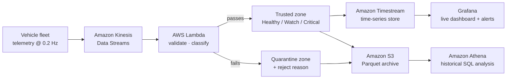

# FleetPulse — Real-Time EV Fleet Telemetry Pipeline

**Telling a genuine asset fault apart from bad sensor data — in seconds, not after the fact.**

An event-driven AWS pipeline that ingests high-volume vehicle telemetry, validates it,
quarantines what fails, classifies fleet condition as **Healthy / Watch / Critical**, and
surfaces the result to the people who have to act on it.

| | |
|---|---|
| **Records processed** | 258,753 across a full 8-hour operating shift |
| **Fleet simulated** | 50 vehicles, telemetry every 5 seconds |
| **Clean-data rate** | **90.09%** — the remaining 9.91% quarantined with a reason, not dropped |
| **Critical conditions found** | 6,150 readings across 31 vehicles |
| **Key finding** | **One vehicle (FP-0016) accounts for 18.4% of every critical reading in the fleet** |

---

## 1. The problem

A fleet operations team was losing time on a feed it could not trust.

Vehicle sensors reported speed, battery, motor temperature and GPS position continuously,
but the feed arrived fragmented and unreliable: units dropped fields mid-transmission,
vehicles went silent in tunnels, some records carried physically impossible values
(a motor at 240 °C, a negative speed), and the delivery layer occasionally sent the same
record twice.

The operational consequence was not "messy data". It was this: **when an alert fired,
nobody could tell whether a vehicle was actually overheating or a sensor was lying.**
So alerts got ignored, and genuine faults were found after the vehicle was already off
the road.

The team needed the feed to answer one question reliably — *is this a real asset fault,
or is this bad data?* — and to answer it while the vehicle was still moving.

## 2. What was built

A streaming pipeline where every record takes one of two paths: into a **trusted zone**
where it can drive operational decisions, or into a **quarantine zone** where it is kept,
labelled with why it failed, and made available for investigation.

Quarantine rather than deletion is the design decision worth pausing on. A record that
fails validation is itself evidence: a unit that keeps emitting nulls is a maintenance
job, not noise to be discarded. Throwing failures away destroys the very trail you need
for root-cause work and for audit.



### Why each piece is there

| Component | Why |
|---|---|
| **Kinesis Data Streams** | Absorbs the fleet's continuous writes and decouples producers from processing, so a slow consumer never backs pressure onto the vehicles. Partitioned by `vehicle_id` to keep each vehicle's records in order. |
| **Lambda** | Runs the validation and classification logic per batch. Serverless because the load is bursty and event-shaped — there is nothing to keep running between batches. |
| **Timestream** | Purpose-built time-series storage for the trusted feed: recent data stays in memory for fast dashboard queries, older data tiers to cheap magnetic storage automatically. |
| **S3 + Athena** | Durable Parquet archive of *both* zones, queried with plain SQL for historical and audit work. Columnar Parquet means a query touching two columns doesn't scan the whole shift. |
| **Grafana** | The operational surface: live fleet view plus threshold alerting on overheating and critical battery. |
| **CloudFormation** | The whole stack defined as code, so it can be stood up and torn down repeatably. |

## 3. The validation rules

Four checks, applied in order. The first failure wins and becomes the quarantine reason.

| Check | Rule | Caught |
|---|---|---|
| `DUPLICATE_RECORD` | `(vehicle_id, timestamp)` already seen | 2,064 |
| `MISSING_FIELD` | any required field empty | 15,472 |
| `TYPE_ERROR` | numeric field not parseable (`ERR`, `NaN`, `##`) | 1,205 |
| `OUT_OF_RANGE` | value outside the physical operating envelope | 6,905 |

The range envelope is deliberately wide — it is there to catch *sensor* faults, not
vehicles in an extreme state. A motor at 130 °C is a serious fault and must reach the
operations team; a motor at 240 °C is a broken thermistor.

```
speed_kmh     0 – 200        motor_temp_c   -40 – 150
battery_pct   0 – 100        lat / lon      within Victoria
```

## 4. Turning trusted data into a priority list

Validated records are classified against the operating thresholds, so the team receives a
ranked view instead of a raw feed.

| Status | Condition | Share of trusted records |
|---|---|---|
| **CRITICAL** | motor > 110 °C **or** battery < 10% | 2.64% (6,150) |
| **WATCH** | motor > 95 °C **or** battery < 20% | 9.36% (21,820) |
| **HEALTHY** | everything else | 88.00% (205,137) |

**The finding that mattered.** Critical readings were not spread evenly across the fleet.
Six vehicles ever crossed the 110 °C line, and a single unit — **FP-0016** — produced
**1,133 of the 6,150 critical readings (18.4%)**, every one of them temperature-driven,
peaking at 145 °C.

That reframes the work order completely. The dashboard says "the fleet has a heat
problem." The data says "one vehicle has a cooling problem, and it is generating a fifth
of your critical alerts." Those lead to very different maintenance decisions.

Fault codes corroborate the reading rather than duplicating it: `F-BAT-LOW` (5,860) and
`F-MOT-TEMP` (5,536) dominate and track the measured telemetry, while genuinely
independent faults — tyre pressure, brake wear, inverter comms — sit well below them.

## 5. Repository contents

```
scripts/
  generate_telemetry.py   Physics-based fleet simulator (the data source)
  producer_kinesis.py     Streams records into Kinesis, partitioned by vehicle_id
  consumer_kinesis.py     Reads back off a shard — used to verify the stream end to end
  validate_telemetry.py   Reference implementation of the Lambda logic
data/
  telemetry.csv           258,753 records · 18 MB · one 8-hour shift
  fleet_metadata.csv      Per-vehicle model, battery capacity, depot, commissioning date
  quality_report.json     Every figure quoted in this README, reproducible
  generation_summary.json Simulation parameters and injected-defect counts
```

### About the dataset

The operational data behind this engagement is not publishable, so the repository ships a
**physics-based simulator** that reproduces the same failure modes, and every number above
is measured from its output.

The simulator is not a random-number generator with column names. Each vehicle is a
stateful agent moving through IDLE / DRIVING / CHARGING phases: battery drains as a
function of speed and recharges when the unit docks, motor temperature relaxes towards a
speed-dependent equilibrium, and position integrates from heading and speed across the
Melbourne metro area.

Two properties make it useful rather than decorative:

- **Faults are causal.** `F-BAT-LOW` only fires on a genuinely depleted battery,
  `F-MOT-TEMP` only on a genuinely hot motor, `F-CHG-INTERLOCK` only while charging. If
  fault codes did not track the telemetry, "can the pipeline separate real faults from bad
  data" would be an unanswerable question.
- **Degradation is modelled, not sprinkled.** A minority of units carry a cooling circuit
  that degrades under sustained load. This is what produces FP-0016 — a genuine, gradually
  worsening asset failure that the pipeline has to detect, rather than a random spike
  injected to make the demo look good.

Defects are then injected on top at realistic rates — dropped fields, tunnel signal gaps,
impossible values, at-least-once duplicates — which is what puts the clean-data rate at
90% rather than an unrealistic 99%.

## 6. Reproducing the results

```bash
# Generate one 8-hour shift for a 50-vehicle fleet (deterministic under --seed)
python scripts/generate_telemetry.py --vehicles 50 --duration-min 480 --hz 0.2 --seed 42

# Validate, classify, and write data/quality_report.json
python scripts/validate_telemetry.py --input data/telemetry.csv --out-dir data

# Optionally emit the trusted and quarantine zones as separate extracts
python scripts/validate_telemetry.py --write-zones
```

Both scripts use only the Python standard library. Streaming to AWS additionally requires
`boto3` and configured credentials:

```bash
python scripts/producer_kinesis.py    # publish records to the stream
python scripts/consumer_kinesis.py    # read them back to confirm delivery
```

## 7. Where this applies beyond EVs

The vehicle is incidental. The pattern — *high-volume sensor feed from distributed
physical assets → validate → quarantine with a reason → classify by severity → alert and
archive for audit* — is the same problem faced by any asset-intensive operation:
traffic signals and roadside ITS equipment, communications and electrical infrastructure,
industrial plant.

In each case the operational question is identical: **is this asset genuinely failing, or
is the instrument reporting it broken?** — and the cost of answering it wrongly is a
maintenance crew dispatched to the wrong place, or a real fault left in the field.

## 8. Current status and next steps

| Stage | Status |
|---|---|
| Fleet simulator with causal faults and modelled degradation | Complete |
| Kinesis producer / consumer, partitioned by vehicle | Complete |
| Validation, quarantine and health classification logic | Complete |
| Deployment of the validation logic as a Kinesis-triggered Lambda | In progress |
| Timestream sink and Grafana dashboard with threshold alerting | In progress |
| Athena tables over the S3 Parquet archive | Planned |
| CloudFormation template for the full stack | Planned |
| GitHub Actions running Pytest on push | Planned |

**Stack:** Python · AWS Kinesis · Lambda · Timestream · S3 · Athena · Grafana ·
CloudFormation · Parquet · SQL
